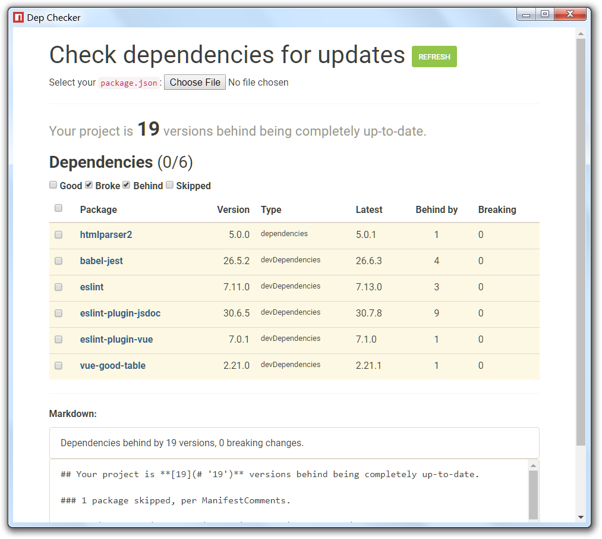

# DepChecker

### Check how far behind your dependencies are in your project.

Because of NPM's API not allowing direct requests in a browser ([y tho](http://i0.kym-cdn.com/entries/icons/original/000/022/978/yNlQWRM.jpg)) you can't run this in a regular browser.

You either need to run the `index.html` in a Chrome instance started with this argument passed in `--disable-web-security`.

Or you can run it in NW.js by doing an `npm install` and `npm start`.

* * *

**Known bugs:**

* Version diffing is pretty rudimentary. For example using `x` in a version number (`1.3.x`) will be ignored and the numbers will be off.

This was just for a quick thing I needed, I'm not going to be updating this, but will accept any PR that improves the primary functionality.

* * *

Made with Vue.js and NW.js.
